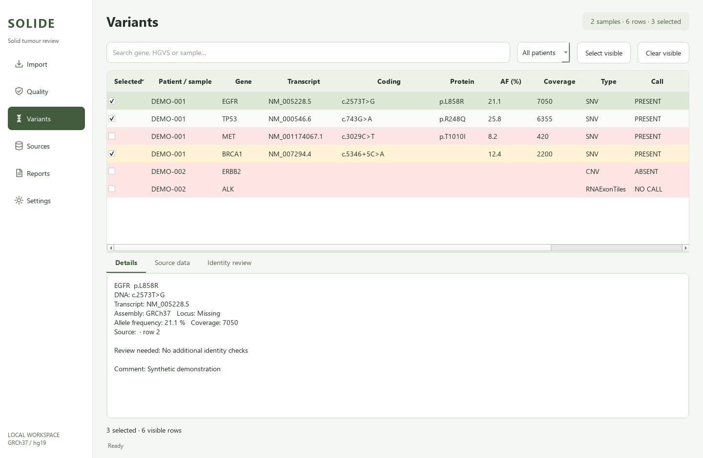

# Solide

Local Windows desktop app for solid tumour variant review. Import Ion Reporter
and Genexus exports, review row-level quality, select variants, collect database
evidence through Edge, and export one Excel workbook per patient.



## Install and start

Python 3.11+ and Microsoft Edge are required.

```powershell
python -m pip install -e ".[dev]"
python start_python_felles.py
```

After installation, `SOLIDE_START.cmd` also starts the app.

To open a saved local review directly:

```powershell
python start_python_felles.py --session "C:\path\review.solide.json"
```

For the laboratory's **Python FELLES** environment:

1. Save the project in a permanent folder.
2. Run `SOLIDE_INSTALL.cmd`, paste the copied command into Python FELLES and press Enter.
3. Close Python FELLES, run `SOLIDE_START.cmd` and paste its start command.
4. Choose an approved local workspace folder in **Settings**.

The shared-interpreter bootstrap follows
[MolStat](https://github.com/Christian-Bjornstad/MolStat). Ivanti app ID 15694
and Python FELLES compatibility must be checked on the work PC. Installation
uses the user's site-packages without administrator rights. Failure logs are
written to `%LOCALAPPDATA%\Solide\logs\bootstrap.log`.

## Workflow

1. **Workspace** imports TSV or Genexus XLSX; confirm patient / sample ID and assembly.
2. Switch the workspace view to **Quality** to check every imported row, including unselected rows.
3. **Variants** lets you filter, select and review variant identity. **Assess variant**
   saves classification, report decision, reviewer and assessment notes in the app.
4. **Searches** selects databases and MTBP tissue (default **Other**). Save the
   session, sign in through Settings where needed, then run searches.
5. Review source status and screenshots before exporting **Reports**.

Sessions preserve source data, app assessments, reviewed HGVS and search history locally.
Assessment is performed in the app. Excel is a versioned snapshot; edits to an
exported workbook are not read back.
Pause and stop take effect at checkpoints; active browser or HTTP requests may
need to finish first. Provisional captures remain marked as partial evidence.

### Accounts, activity and reruns

**Settings → Text size** offers 14, 16, 18 and 20 px; 16 px is the default.
Dialogs, dropdowns and progress text keep readable colours with Windows dark themes.

**Settings → Database accounts** supports Franklin, COSMIC, OncoKB and MTBP.
Enter a username and optional password, then **Save account**. Usernames stay
in local settings; passwords use Windows Credential Manager under a separate
Solide namespace through [keyring](https://keyring.readthedocs.io/en/latest/).
Passwords are never stored in session JSON, settings JSON, reports or logs.
**Forget password** removes the stored credential; it does not clear Edge cookies.
**Sign in / check** opens visible Edge and records the last confirmed sign-in.
This timestamp is a past check, not a guarantee that a session is still valid.
If the vault is unavailable, visible sign-in and existing Edge sessions still work.

The **Log** button is available on every page. A rotating activity log is saved
under `%LOCALAPPDATA%\Solide\logs\activity.log`; **Open log folder** is in Settings.
Running searches show completed source jobs, matches, failures, review needs,
elapsed time and current provider activity. Partial captures do not count as
completed jobs.

- **Run pending**: new, incomplete and outdated source searches.
- **Retry failed**: failed searches, including missing captures and ambiguous results.
- **Rerun… → Selected results**: highlighted result rows, including completed results.
- **Rerun… → All selected variants**: every selected variant and checked source.

Rerunning any MTBP result targets the complete selected patient batch. An uncertain
submission retains its exact report ID and is reconciled before submitting it again.
Previous evidence is archived in local session history before replacement.
The result list includes **Pending**, **Verified match**, **Review match**,
**No match**, **Outdated** and explicit failure states. **Verified match** requires
returned genomic identity evidence, or exact versioned HGVS for BRCA Exchange;
a found record alone does not qualify.
Source screenshots are checked for readable content. **View evidence** opens
the source response and captured images. Excel reports include the same match
assessment. Clinical significance still requires professional review.

## Quality and nomenclature

| Check | Result |
|---|---|
| Coverage <500 on a row | Failed coverage |
| CNV Copy Number <1 | Failed CNV |
| CNV Copy Number =1 | Review boundary value |
| RNAExonTiles NO CALL | Failed expression imbalance |
| RNAExonVariant ABSENT | Included as a status, not a positive finding |
| Intronic HGVS offset 1–100 bp | SpliceAI candidate |

Missing numeric QC values are unknown. Coverage describes exported rows, not
whole-gene coverage. Assay / gene-package selection currently follows the imported
export; the laboratory must define any additional panel rules.

Delins / complex variants require Mutalyzer review. Known FGFR1 and MET transcript
differences require mapped, reviewed HGVS on the target transcript:

| Gene | Exported transcript | Target transcript |
|---|---|---|
| FGFR1 | NM_001127500.3 | NM_023110.3 |
| MET | NM_001174067.1 | NM_000245.4 |

Mutalyzer returns suggestions for manual approval in **Identity review**.
Corrected HGVS never silently reuses original genomic alleles. Enter matching
reviewed hg19 `chr-pos-REF-ALT` when a genomic lookup is needed after correction.

## Database evidence

ClinVar, Franklin, COSMIC, OncoKB and MTBP use the pinned
[Archer Edge/CDP runtime](docs/ARCHER_REUSE.md). Sign-in uses visible Edge;
automated windows are minimised by default. Edge remote debugging must be allowed.
Mutalyzer, SpliceAI and BRCA Exchange use HTTP adapters. BRCA Exchange runs only
for **BRCA1 / BRCA2**. It checks exact GRCh37 alleles or complete versioned HGVS,
and saves the source classification, accession, dataset release and identity
assessment separately from the app classification. The public API may change:
unexpected or incomplete responses remain explicit review/error states.
[BRCA Exchange API documentation](https://brcaexchange.org/about/api).

SpliceAI requires confirmed GRCh37 and
explicit REF/ALT, uses `distance=500`, `mask=1`, and runs at least 30 seconds apart.
Genexus XLSX may omit REF/ALT; these must be reviewed before genomic searches.

Gene / protein or identifier-only lookups are explicitly labelled. Multiple
genes / transcripts require identity review. Record HSMD results manually in
the variant comment.

Changing variant identity or tissue marks older evidence as outdated. Changing
the selected patient batch also invalidates the MTBP full report. A resumed MTBP
search reruns the whole selected batch when needed. When identity, tissue or
selection changes, old evidence is retained in local history and a new batch is
created; stale report content is never reused. The MTBP account is emptied before each new submission. Every new report is
removed after local audit/capture, with delayed server verification. Cleanup
failures block submission and remain retryable. This includes reports created
outside Solide, as requested by the account owner. Errors and partial captures remain distinct from **Not found**.

Patient IDs, local filenames, comments and raw worksheets are not sent to providers.
Adapters receive variant data and pseudonymous search IDs. Authenticated profiles
stay under `%USERPROFILE%\.solide\browser_profiles`. Source files, sessions,
reports, credentials and browser profiles are excluded from Git.

Small live ClinVar, Franklin, COSMIC and OncoKB searches were tested locally with
supplied variant data, including captures and a successful retry after an Edge
startup failure. MTBP returned **Sign-in required** and needs a fresh sign-in
before **Other** and full-report capture can be tested. Institutional access
and the work-PC environment still require a laboratory pilot.

## Excel reports

Each export creates a new timestamped workbook per patient without replacing
previous files. The original exports remain untouched.

- **Overview**: selected variants, original and reviewed descriptions, imported
  annotation, app classification/decision/reviewer/notes, and evidence links.
- **Quality**: all QC flags, including unselected rows, with row provenance.
- **Searches**: result and match status, source assertion, accession, capture time,
  links and source responses.
- **Raw data**: original source values and column order, including unnamed
  columns, followed by source hash, sheet and physical row references.
- Variant sheets and a shared full MTBP attachment appear when evidence exists.
  Tall captures are segmented at readable width; outdated screenshots are omitted.

`Include`, `Exclude` and `Pending` are saved app decisions. The workbook retains
every selected variant with its decision for review; it does not automatically
issue a final clinical report or classify variants from database assertions.
Default manual categories follow the reference template, and custom laboratory
classification text can be entered.

Import supports original Ion Reporter TSV and Genexus TSV/XLSX exports with one
unambiguous variant table. Reviewed child templates, target/gene coverage tables
and sample-level QC sheets are separate source structures and are not imported
as variants. ZIP archives were inspected as design references; extract an original
TSV/XLSX export locally before importing. Duplicate columns or competing variant
tables are rejected rather than silently overwriting or duplicating records.
Workbooks exported by Solide are report snapshots and are not import sources.

Text is written safely as text, including original values starting with formula
characters. Excel's cell limit still applies; the session retains full source
values and responses. Source files and image captures remain available locally.

## Development

```powershell
python -m pytest -q
python -m compileall -q src install_python_felles.py start_python_felles.py
python scripts/render_preview.py
```

Tests use synthetic fixtures. The optional local reference-file test is skipped
when the laboratory's untracked input files are absent. The UI preview is synthetic.
Additional private checks used the supplied raw files, archive workbooks and actual
Excel exports; their data, sessions, reports and screenshots stay outside Git.
See [verification](docs/VERIFICATION.md) for tested scope and remaining checks.
